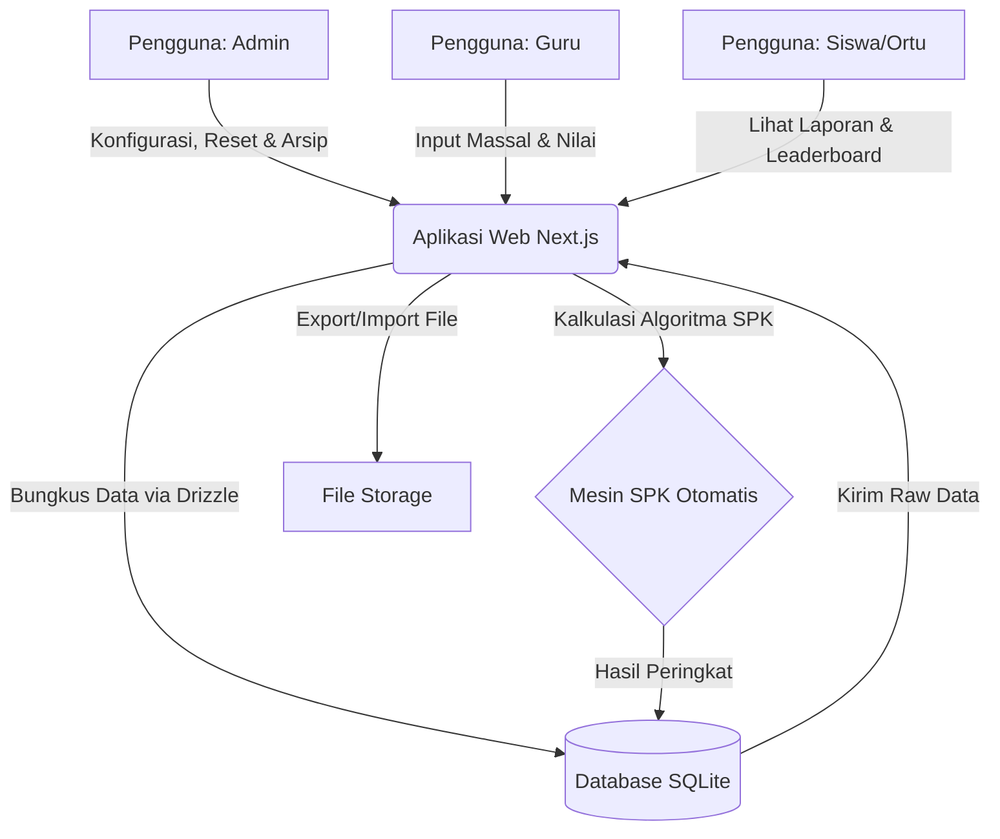
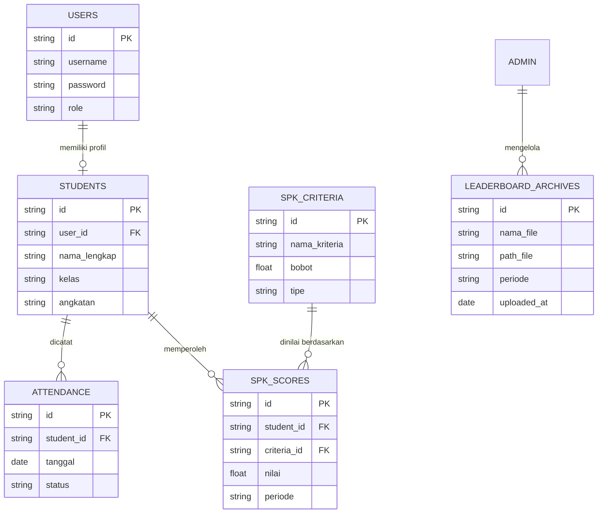
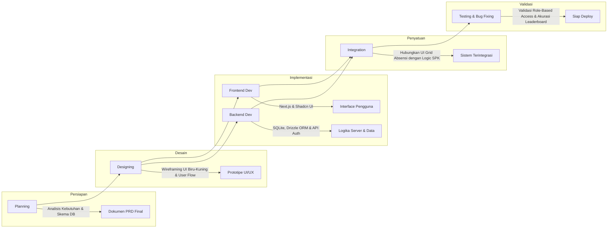

# PRD — Project Requirements Document

## 1. Overview
Sistem Informasi Terintegrasi Absensi & SPK (Sistem Pendukung Keputusan) Siswa Terbaik adalah sebuah aplikasi berbasis web yang dirancang khusus untuk memenuhi kebutuhan Laporan Kerja Praktek (KP). Aplikasi ini bertujuan untuk mendigitalisasi proses administrasi sekolah berkapasitas sekitar 150 siswa yang saat ini masih 100% manual menggunakan Excel. 

Masalah utama yang diselesaikan adalah pencatatan kehadiran siswa (karena peraturan sekolah melarang siswa membawa HP) yang kini bisa dilakukan langsung oleh guru melalui interface tabel massal yang efisien (Excel-like UI), serta sistem penilaian "Siswa Terbaik" yang objektif melalui perhitungan otomatis menggunakan metode SPK tertentu dari berbagai kriteria. Sistem ini menerapkan pembagian hak akses berbasis peran (Role-Based Access Control) untuk memastikan keamanan dan relevansi data bagi setiap pengguna, termasuk manajemen leaderboard berbasis periode semester dengan tampilan berjenjang (Kelas, Angkatan, Umum).

## 2. Requirements
- **Digitalisasi Proses Manual**: Sistem harus bisa menggantikan Excel namun tetap menyediakan fitur *Bulk Import* Excel agar transisi data lama lebih mudah.
- **Kapasitas Skala Kecil**: Sistem difokuskan untuk menangani data yang ringan (sekitar 150 siswa) sehingga harus responsif dan hemat sumber daya.
- **Pembagian Peran Pengguna (Role-Based Access)**:
  - **Admin/Tata Usaha (TU)**: Memiliki kontrol penuh (full access) terhadap konfigurasi sistem, manajemen akun, kebijakan penilaian, dan arsip leaderboard.
  - **Guru Mapel/Wali Kelas**: Memiliki akses terbatas (restricted access) hanya pada kelas yang diampu untuk keperluan operasional harian (Import Template & Input Massal Absensi & Nilai) melalui interface mirip spreadsheet.
  - **Siswa/Orang Tua**: Memiliki akses khusus (read-only) hanya untuk melihat data pribadi siswa terkait dan leaderboard publik.
- **Desain UI/UX Khusus**: Tampilan antarmuka harus bersih dan profesional, menggunakan skema warna Biru Utama (`#1F4E78`) dan aksen Kuning (`#f2a600`).
- **Akses Praktis**: Tidak membutuhkan verifikasi email yang rumit. Cukup login menggunakan NIP untuk pegawai dan NIS untuk siswa (dengan kata sandi default berupa NIS).
- **Siklus Semester**: Sistem harus mendukung siklus per semester termasuk fitur reset data penilaian, ekspor hasil, dan pengarsipan riwayat leaderboard.

## 3. Core Features
Fitur sistem dibagi secara spesifik berdasarkan peran pengguna untuk memastikan fokus fungsionalitas yang tepat:

### A. Fitur Khusus Admin (Kontrol Penuh)
- **Manajemen Master Data**: CRUD (Create, Read, Update, Delete) untuk data Guru, Siswa, Kelas, dan Mata Pelajaran.
- **Pengaturan Bobot SPK**: Kemampuan untuk mengubah bobot persentase dari 5 kriteria SPK secara dinamis sesuai kebijakan sekolah.
- **Manajemen Tahun Ajaran & Kenaikan Kelas**: Fitur untuk mengarsipkan data tahun lalu dan menaikkan tingkat kelas siswa secara massal di akhir periode.
- **Impor Data Massal**: Unggah file Excel untuk inisialisasi data siswa dan guru guna mempercepat setup awal.
- **Manajemen Akun**: Reset kata sandi pengguna atau menonaktifkan akun yang tidak aktif.
- **Manajemen Leaderboard & Arsip**:
  - **Reset Periode**: Fitur untuk mereset perhitungan leaderboard SPK saat pergantian semester baru.
  - **Export Data**: Mengunduh hasil ranking leaderboard akhir semester dalam format Excel atau PDF sebelum reset dilakukan.
  - **Upload Arsip Historis**: Unggah file rekapitulasi leaderboard periode sebelumnya sebagai riwayat (legacy data) yang dapat diakses kembali oleh sistem.

### B. Fitur Khusus Guru (Operasional Kelas)
- **Import Template & Excel-like UI**: 
  - Guru mengunduh template Excel yang sudah terisi nama siswa sesuai kelas yang diampu.
  - Setelah template diimpor/dikonfirmasi, sistem menampilkan **Grid Absensi Interaktif** (tampilan seperti spreadsheet) yang berisi daftar siswa satu kelas secara sekaligus.
  - Guru dapat mengisi status (Hadir, Izin, Sakit, Alfa) secara cepat pada sel tabel tanpa perlu membuka halaman detail per siswa.
- **CRUD Nilai Kriteria Non-Otomatis**: Hak akses penuh untuk input, edit, atau hapus penilaian manual untuk kriteria seperti *Kedisiplinan*, *Keaktifan Ekskul*, dan *Prestasi Lomba* (sesuai wewenang guru tersebut).
- **Rekap Kelas**: Melihat ringkasan kehadiran dan nilai siswa di kelasnya sendiri untuk keperluan evaluasi wali kelas.

### C. Fitur Khusus Siswa/Orang Tua (Pemantauan)
- **Dashboard Personal**: Tampilan khusus yang hanya menampilkan data milik siswa yang login (tidak bisa melihat data siswa lain).
- **Visualisasi Kehadiran**: Grafik atau tabel riwayat absensi siswa sendiri.
- **Akses Leaderboard Multi-Level**: Fitur melihat peringkat siswa terbaik dengan 3 kategori tampilan:
  1. **Per Kelas**: Peringkat siswa hanya dalam kelasnya sendiri.
  2. **Per Angkatan**: Peringkat siswa dalam tingkat kelas yang sama (misal: semua kelas 10).
  3. **Umum (Seluruh Siswa)**: Peringkat siswa terbaik se-sekolah.
- **Cetak Laporan**: Fitur untuk mengunduh atau mencetak laporan kehadiran dan nilai sederhana.

## 4. User Flow
Alur kerja sistem dirancang dengan pembatasan akses yang ketat sesuai peran:

1. **Alur Admin/TU (Konfigurasi & Manajemen)**
   Login NIP -> Verifikasi Role 'ADMIN' -> Akses Menu Master Data -> Unggah File Excel Data Siswa/Guru -> Masuk ke Menu Konfigurasi SPK -> Atur Bobot 5 Kriteria Utama -> Kelola Tahun Ajaran -> Logout.
   
2. **Alur Guru (Aktivitas Harian & Penilaian)**
   Login NIP -> Verifikasi Role 'GURU' -> **Sistem Memfilter Kelas Berdasarkan Data Pengajaran** -> Pilih Kelas yang Diampu.
   **Langkah Absensi**: 
   1. Unduh Template Excel Kelas (opsional jika data belum ada) -> Isi/Verifikasi Offline -> Upload Kembali.
   2. **Sistem Muat Grid Absensi (Tabel Siswa)** -> Guru mengisi status kehadiran (Hadir/Izin/Sakit/Alfa) langsung pada sel tabel yang tersedia untuk seluruh siswa sekaligus -> Klik "Simpan Semua" -> Data Tersimpan.
   Di akhir semester, Guru masuk ke Menu Penilaian -> Input/Edit nilai Kedisiplinan/Akademik untuk siswa di kelasnya -> Simpan.

3. **Alur Sistem SPK (Otomatis & Terpusat)**
   Sistem menarik data nilai Inputan Guru + Persentase Kehadiran -> Melakukan perkalian dengan Bobot yang diatur Admin -> Menghasilkan Peringkat Siswa Terbaik -> Menyimpan hasil ke database terkunci (tidak bisa diedit Guru).

4. **Alur Siswa/Orang Tua (Pemantauan Personal)**
   Login NIS -> Verifikasi Role 'SISWA' -> **Sistem Memfilter Data Hanya Milik NIS Tersebut** -> Masuk ke Dashboard -> Melihat Grafik Kehadiran Pribadi -> Memilih Tab Leaderboard (Kelas/Angkatan/Umum) -> Melihat Hasil Peringkat/Nilai SPK -> Selesai.
   *Catatan: Siswa tidak memiliki tombol edit atau input data apapun.*

5. **Alur Akhir Semester (Khusus Admin)**
   Login NIP -> Verifikasi Role 'ADMIN' -> Masuk Menu Manajemen Leaderboard -> Klik "Export Hasil Semester Ini" (PDF/Excel) -> Klik "Reset Leaderboard" (Data nilai semester ini diarsipkan/reset untuk semester baru) -> Klik "Upload Arsip Historis" (Unggah file rekap semester lalu untuk riwayat) -> Logout.

## 5. Architecture
Aplikasi ini menggunakan arsitektur monolitik modern berbasis `Next.js` di mana *Frontend* (Antarmuka) dan *Backend* (API/Server) beroperasi dalam satu kerangka kerja. Server berkomunikasi langsung dengan basis data `SQLite` yang sangat cocok dan efisien untuk kebutuhan sekolah berskala 150 siswa.

## 6. Database Schema
Berikut adalah tabel-tabel utama yang diperlukan dalam database SQLite:

- **Pengguna (`users`)**: Menyimpan data autentikasi semua pihak.
  - `id` (String/UUID): Primary Key
  - `username` (String): NIP atau NIS
  - `password` (String): Kata sandi terenkripsi
  - `role` (String): 'ADMIN', 'GURU', atau 'SISWA'
- **Siswa (`students`)**: Data profil khusus siswa.
  - `id` (String): Primary Key
  - `user_id` (String): Foreign Key ke tabel `users`
  - `nama_lengkap` (String): Nama Siswa
  - `kelas` (String): Tingkatan Kelas saat ini
  - `angkatan` (String): Tahun angkatan siswa
- **Absensi (`attendance`)**: Rekam jejak kehadiran harian siswa.
  - `id` (String): Primary Key
  - `student_id` (String): Foreign Key ke tabel `students`
  - `tanggal` (Date): Tanggal absensi
  - `status` (String): 'Hadir', 'Izin', 'Sakit', 'Alfa'
- **Kriteria SPK (`spk_criteria`)**: Aturan dan bobot untuk perhitungan SPK.
  - `id` (String): Primary Key
  - `nama_kriteria` (String): Misal: 'Nilai Akademik', 'Kehadiran'
  - `bobot` (Float): Angka persentase/bobot kepentingan
  - `tipe` (String): 'Otomatis' atau 'Manual'
- **Nilai SPK (`spk_scores`)**: Skor mentah siswa terhadap tiap kriteria.
  - `id` (String): Primary Key
  - `student_id` (String): Foreign Key ke tabel `students`
  - `criteria_id` (String): Foreign Key ke tabel `spk_criteria`
  - `nilai` (Float): Poin kriteria yang dicapai siswa
  - `periode` (String): Penanda semester/tahun ajaran (untuk reset data)
- **Arsip Leaderboard (`leaderboard_archives`)**: Menyimpan file historis leaderboard yang diupload admin.
  - `id` (String): Primary Key
  - `nama_file` (String): Nama file arsip
  - `path_file` (String): Lokasi penyimpanan file
  - `periode` (String): Periode semester tahun ajaran arsip
  - `uploaded_at` (Date): Tanggal upload

## 7. Tech Stack
- **Framework Frontend & Backend**: [Next.js](https://nextjs.org/) (App Router) — Mendukung UI dinamis sekaligus API di satu tempat.
- **Database**: [SQLite](https://sqlite.org/) — Sangat cepat, efisien, dan tidak butuh *setup server database* khusus (sangat ideal untuk 150 siswa).
- **ORM (Penghubung Database)**: [Drizzle ORM](https://orm.drizzle.team/) — Modern, ringan, dan sangat bersahabat dengan TypeScript/Next.js.
- **Styling UI**: [Tailwind CSS](https://tailwindcss.com/) — Untuk penulisan CSS yang cepat dengan sistem pewarnaan Custom (Biru & Kuning).
- **Komponen UI**: [shadcn/ui](https://ui.shadcn.com/) — Komponen rapi (seperti tombol, tabel, dialog) yang siap ditaruh (*copy-paste*) sehingga UI terlihat profesional.
- **Tabel Interaktif**: [TanStack Table](https://tanstack.com/table) — Digunakan khusus untuk membuat fitur input absensi berbasis grid/spreadsheet yang responsif bagi Guru.
- **Autentikasi**: [Better Auth](https://better-auth.com/) — Sistem pengelolaan sesi login yang aman dan stabil digunakan di Next.js.
- **Deployment**: [Vercel Cloud](https://vercel.com/) — Hosting gratis (tier hobi) atau berbayar murah yang terintegrasi secara bawaan dengan Next.js.

## 8. Development Roadmap & Workflow
Berikut adalah alur proses pengembangan sistem dari tahap perencanaan hingga pengujian akhir untuk memastikan kualitas dan kesesuaian dengan kebutuhan sekolah.

**Tahapan Pengembangan:**
1.  **Planning**: Analisis kebutuhan detail, finalisasi PRD, dan perancangan skema database SQLite.
2.  **Designing**: Pembuatan wireframe dan prototipe UI dengan skema warna Biru (`#1F4E78`) - Kuning (`#f2a600`) serta validasi User Flow.
3.  **Frontend Development**: Implementasi antarmuka menggunakan Next.js, Tailwind CSS, dan komponen shadcn/ui (termasuk tabel interaktif TanStack).
4.  **Backend Development**: Setup database SQLite, konfigurasi Drizzle ORM, dan pengembangan API untuk autentikasi serta logika bisnis.
5.  **Integration**: Menghubungkan frontend (UI Grid Absensi) dengan backend (Logic SPK & Database) memastikan aliran data berjalan lancar.
6.  **Testing & Bug Fixing**: Pengujian menyeluruh termasuk validasi Role-Based Access Control (Admin/Guru/Siswa) dan akurasi perhitungan Leaderboard sebelum deployment.